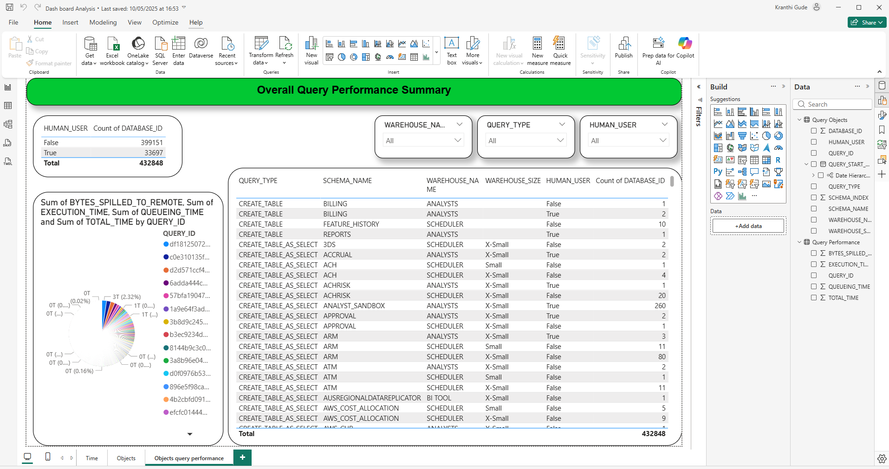

# PowerBI-Dashboard-Portfolio
Operational Query Performance Analytics Dashboard designed to identify execution bottlenecks, optimize warehouse sizing, and improve system efficiency using Power BI and DAX.

Objective

This dashboard analyzes database query execution performance to identify bottlenecks and improve warehouse efficiency.

📊 Key Metrics

Average Total Time

Average Execution Time

Average Queueing Time

Bytes Spilled to Remote

Dashboard Preview

